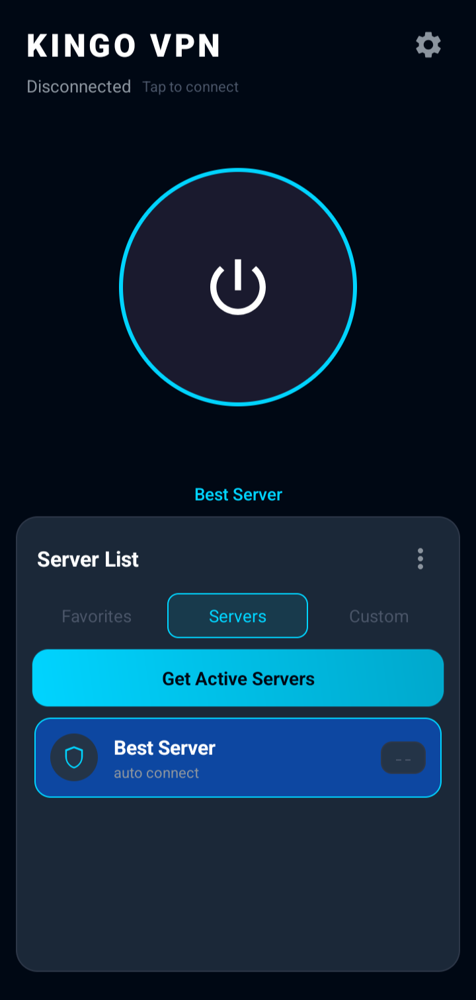

# 🚀 Kingo VPN

  
  
  

  <b>یک کلاینت قدرتمند و سبک VPN برای اندروید با پشتیبانی از پروتکل‌های مدرن</b>

---

## ✨ ویژگی‌ها

✅ رابط کاربری ساده و سریع  
✅ پشتیبانی از VLESS / VMess / Trojan / Shadowsocks  
✅ استفاده از هسته V2Ray/Xray  
✅ تست سرعت و تأخیر سرورها  
✅ مدیریت آسان کانفیگ‌ها  
✅ عملکرد بهینه در اندروید  
✅ متن‌باز و قابل توسعه  

---

## 📱 اسکرین‌شات

  

---

## 🛠️ ساخت پروژه

پروژه با ابزارهای زیر ساخته شده است:

- Android Studio / Gradle
- Java
- V2Ray Core
- Xray Core

---

## 📥 نصب

آخرین نسخه را از بخش Releases دریافت کنید:

➡️ [Download APK](../../releases)

---

## ⭐ حمایت از پروژه

اگر Kingo VPN برای شما مفید بوده است، با دادن یک ⭐ به پروژه در GitHub از توسعه آن حمایت کنید.

هر ستاره کمک بزرگی برای ادامه توسعه است ❤️

---

## 🤝 مشارکت

پیشنهادها، گزارش مشکلات و Pull Request ها خوشحال‌کننده هستند.

برای مشارکت:

1. پروژه را Fork کنید
2. تغییرات خود را اعمال کنید
3. Pull Request ارسال کنید

---

## 📄 License

این پروژه تحت مجوز MIT منتشر شده است.

---

  Made with ❤️ by Kingo Team

ساب v2ray با آپدیت ساعتی 
لینک ساب: https://raw.githubusercontent.com/kingowow/Kingo-vpn/main/merged_config.txt
